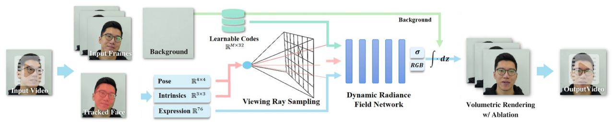

# iContact using NeRFace

## Features



| Input | Output |
|-------|--------|
|  |  |

## Setting up the environment

- Clone the repository
  
  ```shell
  git clone https://github.com/joiellantero/NeRFace.git
  ```

- Navigate to the directory of the project.

  ```shell
  cd ./NeRFace/nerface_code
  ```

- Create a virtual environment using the environment.yml file

  ```shell
  conda env create -f environment.yml
  ```

- Activate the virtual environment.

  ```shell
  conda activate nerf
  ```

- Optional: Install Pytorch3D (Only do this if it's not yet installed)

  - Recommended to be installed from a local clone

    - Navigate to `cd ./nerface_code/nerf-pytorch`
    - clone and install pytorch3D
    
      ```shell
      git clone https://github.com/facebookresearch/pytorch3d.git
      cd pytorch3d && pip install -e .
      ```

## Training the model

- Download the dataset [here](https://drive.google.com/drive/folders/1rr8UzLbzWI62qbagQF2lnlsZP3Fr_Uu1?usp=sharing)

- Navigate to the training script

  ```shell
  cd ./NeRFace/nerface_code/nerf-pytorch
  ```

- Double check if you have activated the virtual environment

  ```shell
  conda activate nerf
  ```

- Run the training script

  - The training should run for approximately 6 days using a computer with these specifications: NVIDIA 3070 Ti GPU with 8GB vRAM, Ryzen 7 5800 with 32GB RAM.

  - The dataloader file is an optimized version of the training script to make it run on GPU’s with below 70GB ram.

    ```shell
    python3 train_transformed_rays_dataloader.py --config ../../data/person_1/person_1_config.yml
    ```

    - It's recommended to use `nohup` to run it in the background

      ```shell
      nohup python3 train_transformed_rays_dataloader.py --config ../../data/person_1/person_1_config.yml &
      ```

## Processing input video using the trained model

> The output will be several photos--these are the processed frames of the video. These will be converted to a video in the next step

- Navigate to `./NeRFace/nerface_code/nerf-pytorch`

  ```shell
  cd ./NeRFace/nerface_code/nerf-pytorch
  ```

- Create a folder named "renders"
- Create a folder inside the "renders" folder named "exp_1"

  > You may also use a different name other than exp_1
  > This is where the processed images will be saved

- Run the script

  > The eval_transformed_rays.py was added with an ablation code that sets the direction of the talking head into a fixed novel viewpoint, thus, correcting eye gaze and head position. 

  ```shell
  python eval_transformed_rays.py --config ../../data/person_1/person_1_config.yml --checkpoint ./logs/person_1/checkpoint999999.ckpt --savedir ./renders/<yourfoldername>

  python eval_transformed_rays.py --config ../../data/person_1/person_1_config.yml --checkpoint ./logs/person_1/checkpoint999999.ckpt --savedir ./renders/exp_1
  ```

## Converting the images to video

  ```shell
  ffmpeg -i renders/<yourfoldername>/%04d.png -pix_fmt yuv420p -crf 19 ./<youroutputfilename>.mp4

  ffmpeg -i renders/exp_1/%04d.png -pix_fmt yuv420p -crf 19 ./out.mp4
  ```

## References

- [Original repository by Guy Gafni](https://github.com/gafniguy/4D-Facial-Avatars.git)